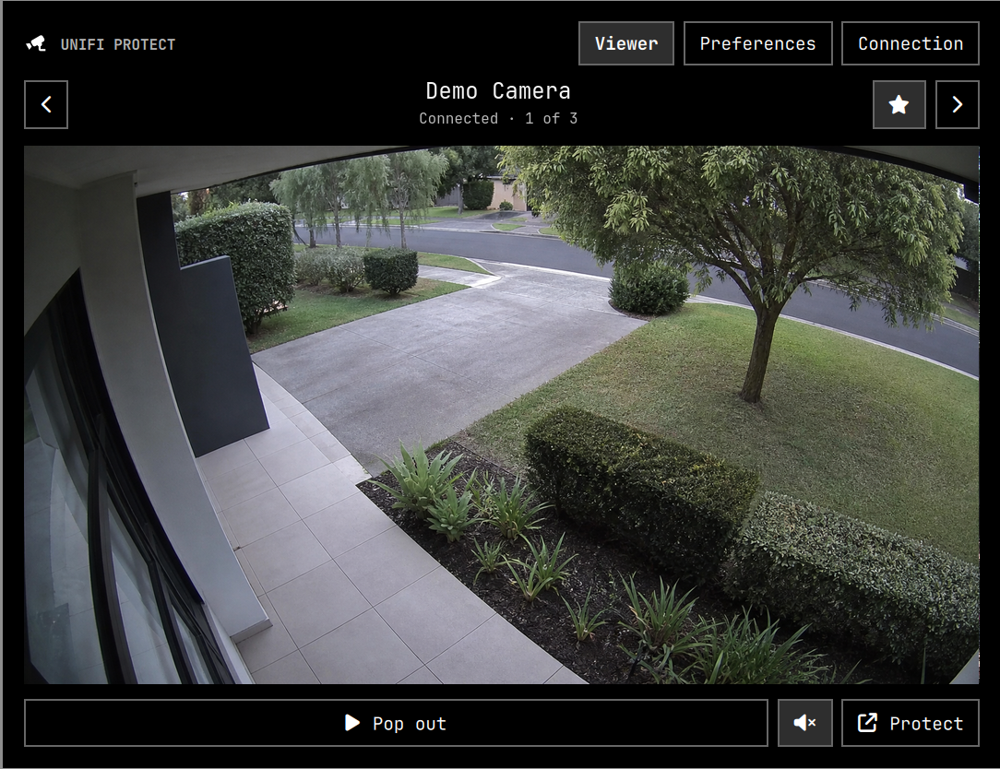

<h1 align="center">UniFi Protect Viewer</h1>

<p align="center">
  A read-only UniFi Protect camera viewer for Omarchy
</p>

<p align="center">
  <a href="https://omarchy.org"></a>
  <a href="LICENSE"></a>
</p>

<p align="center">
  
</p>

<p align="center"><em>The camera scene and camera metadata are synthetic; no private footage is shown.</em></p>

UniFi Protect Viewer puts one camera at a time in the Omarchy bar. Open
the popup, switch cameras, and choose between efficient snapshots or an
existing RTSPS feed for real-time video. Camera traffic stops when the popup
closes.

Real-time mode fetches one still immediately as a startup preview, then
replaces it with video as soon as the RTSPS feed is ready.

It deliberately leaves timelines, detections, exports, users, stream setup,
and camera controls in Protect. The plugin never changes the console.

## Install

```bash
omarchy plugin add https://github.com/luxore/omarchy-unifi-protect.git --enable
```

Open the camera icon in the bar. Setup needs two values:

1. Enter the HTTPS address of the UniFi OS console that runs Protect.
2. Paste a UniFi API key and choose **Connect**.

Create the key in [UniFi Site Manager](https://unifi.ui.com/) under
**Settings > API Keys**. The key is tested against the local Protect API and
stored in Secret Service. It never enters `shell.json`, a URL, a process
argument, a log, or a file.

Self-signed console certificates are common. A trusted certificate is the
recommended fix. If that is not practical on a private network, turn off
**Verify TLS certificate** during setup; the plugin keeps HTTPS encryption but
can no longer detect a machine impersonating the console.

## Use

| Input | Action |
|---|---|
| Left click | Open or close the camera viewer |
| Arrow keys or `J`/`K` | Select the previous or next camera |
| Enter | Open the selected camera's existing RTSPS feed in `mpv` |
| `F` | Set or clear the selected camera as the default |
| `M` | Toggle the live-window mute preference |
| `O` | Open UniFi Protect in the browser |
| `P` | Open Preferences |
| `C` | Open Connection |

The popup watches only the selected camera. Use the star beside its name to
make it the default. Preferences control viewer size, framing, real-time or
snapshot refresh, offline-camera visibility, live quality, and mute state. Selecting an
offline camera stops image requests and shows its actual connection state.

The dedicated live window opens as a normal Hyprland window and tiles by
default. Its scroll wheel zooms instead of changing volume. Horizontal scroll
or `Ctrl` + arrow keys pans, `Ctrl` + `0` resets the view, `M` toggles mute,
and `F` toggles fullscreen.

Live viewing is read-only. The plugin passes Protect's RTSPS URL through an
ephemeral process pipe. `mpv` consumes it for the dedicated window; FFmpeg
remuxes the existing stream without re-encoding it for the popup's tokenized
loopback endpoint. The RTSPS URL never enters settings, command arguments,
logs, or disk. If no stream exists, snapshot modes keep working and the popup
explains that the stream must be enabled in Protect.

Summon the viewer from a script or Hyprland binding:

```bash
omarchy-shell shell toggle io.github.luxore.unifi-protect '{}'
```

## Security and privacy

Omarchy plugins run unsandboxed inside the shared shell process. This plugin
keeps that trust surface narrow:

- It uses the documented local Protect integration API and read-only calls.
- Credentials are retrieved directly from Secret Service by short-lived helper
  processes.
- Credentialed redirects to another origin are rejected.
- Camera frames exist only in the owner-only runtime directory, are written
  atomically with mode `0600`, and disappear at logout.
- Snapshot work is terminated when the popup closes or the selected camera
  changes.
- No daemon, service, cloud relay, analytics, notification listener, or
  persistent background job is installed.

Use a dedicated API key and revoke it in UniFi Site Manager when access should
end. **Forget saved key** removes only the local Secret Service item.

## Remove

Open **Connection** and choose **Forget saved key**, revoke the key in UniFi Site
Manager, then remove the plugin:

```bash
omarchy plugin remove io.github.luxore.unifi-protect
```

## Runtime dependencies

UniFi Protect Viewer requires these host commands:

- Python 3 standard library for the Protect client and snapshot writer.
- `secret-tool` from `libsecret` for credential storage.
- `mpv` for optional low-latency RTSPS viewing.
- FFmpeg for remuxing real-time video into the popup without re-encoding.
- Qt Multimedia for real-time video inside the popup.
- `xdg-open` for the Protect console and API-key page.

The plugin downloads no code and installs no packages.

## Development

```bash
omarchy plugin validate .
python3 -m unittest discover -s test -v
test/lint
```

## License and trademarks

Code is MIT. UniFi and UniFi Protect are trademarks of Ubiquiti Inc. This
independent plugin is not affiliated with, supported by, or endorsed by
Ubiquiti.
